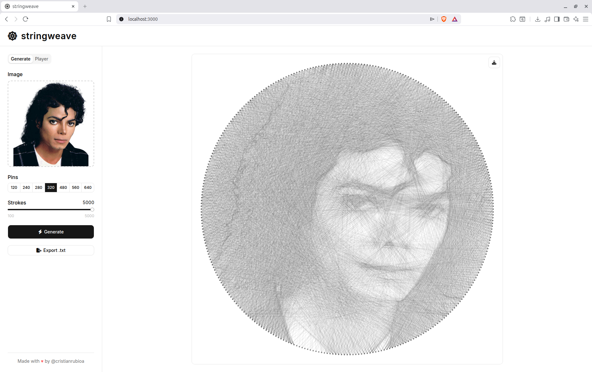
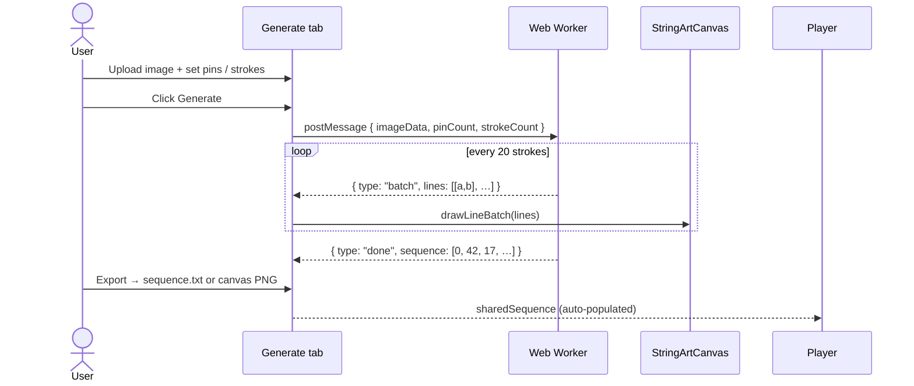
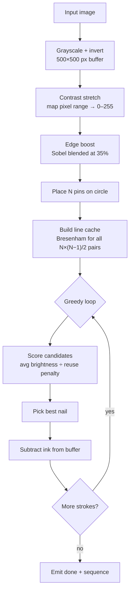

# stringweave


Turns any image into string art. Upload a photo, pick pins and strokes, and watch the drawing build itself — one straight line at a time.



## Features

**Generate** — Upload JPEG/PNG/WebP (up to 5 MB), choose 120–640 pins and up to 5 000 strokes. The algorithm runs off the main thread and streams lines to the canvas as it goes, so the image emerges in real time. Export the nail sequence as `.txt` or download the final canvas as PNG.

**Player** — Import any `.txt` sequence (or use one just generated) and replay it stroke by stroke. Scrub the timeline, step forward/back, or play at speeds from ¼× to 4×.

## How it works



## Algorithm

The worker processes the image through several stages before the greedy stroke loop:



## Sequence file format

Exported `.txt` files use a tab-delimited format:

```
1	0,42,17,305,…
```

Column 1 is a version tag (`1`). Column 2 is the comma-separated nail sequence. The Player infers the pin count from the highest index in the sequence.

## Run

```bash
npm install
npm run dev     # dev server at localhost:3000
npm run build   # production build
```

## License

[MIT](LICENSE)
